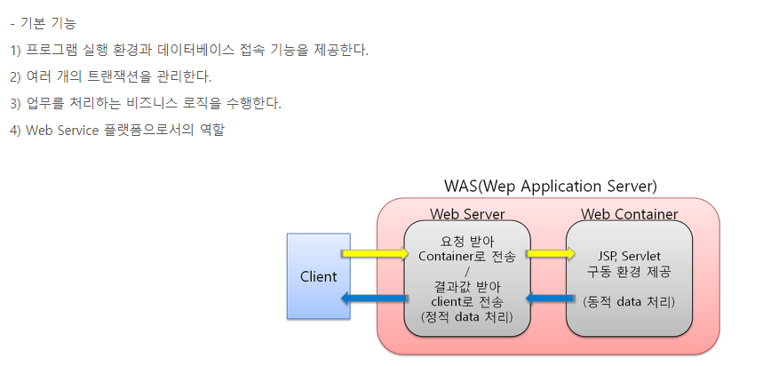
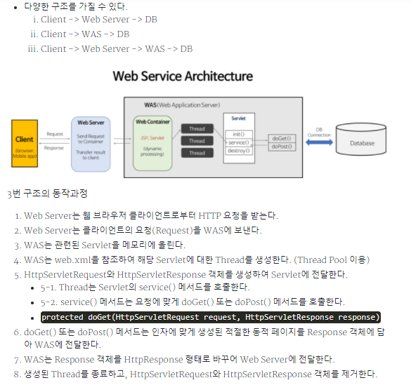

# WEB/WAS

### 웹서버(WEB)이란?

> 웹서버는 말 그대로 작성된 html 페이지등을 네트워크 망에 종속되지 않고, 웹 서비스를 할 수 있도록 해주는 서버.

- 웹 서버는 Static Pages 처리 방식
  - Web Server는 파일 경로 이름을 받아 경로와 일치하는 file contents를 반환.
  - 항상 동일한 페이지를 반환
  - EX) Image, html, css, javascript 파일과 같이 컴퓨터에 저장되어 있는 파일들.
    - 정적 수신과 반환.
  - 웹 서버(소프트웨어): 웹 브라우저 클라이언트로부터 HTTP 요청을 받아들이고, HTML 문서와 같은 웹 페이지에서 흔히 찾아 볼 수 있는 자료 콘텐츠에 따라 HTTP에 반응하는 컴퓨터 프로그램. 
  - 웹 서버(하드웨어): 위에 언급한 기능을 제공하는 컴퓨터 프로그램을 실행하는 컴퓨터

### WAS(Web Application Server, 웹 어플리케이션 서버) 란?

> 웹 서버 + 웹 컨테이너

- 인터넷 상에서 HTTP를 통해 사용자 컴퓨터나 장치에 애프리케이션을 수행해 주는 미들에워(소프트웨어 엔진)이다. 
- WAS 서버는 동적 서버 콘텐츠를 수행하는 것으로 일반적인 웹 서버와 구별이 되며, 주로 데이터베이스 서버와 같이 수행이 된다.
- 웹 서버 + 웹 컨테이너로, 웹 상에서 사용하는 컴퍼넌트를 올려놓고 사용하게 되는 서버.
  - 웹 컨테이너: JSP와 Servlet을 실행시킬 수 있는 소프트웨어.
    - 즉 WAS는 JSP, Servlet 구동 환경을 제공.
  - 웹 서버에서 JSP 요청 -> Tomcat에서 JSP 파일을 Servlet을 변환하여 컴파일 수행 -> Servlet 수행 결과를 웹 서버에게 전달.
  - JPS 컨테이너가 탑재 되어 있는 WAS는 JSP 페이지를 컴파일 해서 동적인 페이지 생성.
  - Servlet 컨테이너, JSP 컨테이너, EJB 컨테이너 등의 종류가 있다. (WebLogic 등)

### WEB과 WAS의 종류

- apache
  - Apache는 소프트웨어의 단체 이름.
  - 우리가 흔히 부르는 아파치 서버라는 것은 이 재단에서 후원하는 오픈소스 프로젝트 커뮤니티에서 만든 http 웹서버.
    - 그냥  http 웹서버 종류라고 알면 될 듯. ㅎ
  - http 웹서버는 http 요청을 처리할 수 있는 웹서버 = 아파치 동일
  - 클라이언트가 GET, POST, DELETE 등의 메소드를 이용해 요청을 하면, 이 프로그램이 어떤 결과를 돌려주는 기능 수행.
- tomcat
  - tomcat은 흔히 WAS라고 함.
  - 앞서 본 Apache 웹 서버와의 차이는 웹 컨테이너 기능이 가능하냐의 차이가 가장 크다...(아마도?, 내 의견임.)

#### WEB과 WAS의 비교

- Web Container의 유무로 WEB과 WAS를 나눌 수 있으며,,,
  - WEB 서버는 HTML 문서 같은 정적 컨테츠를 처리(http 프로토콜을 통해 읽을 수 있는 문서)
  - WAS 서버는 asp, php, jsp 등 개발 언어를 읽고 처리하여 동적 컨텐츠, 웹 응용 프로그램 서비스를 처리.

---

